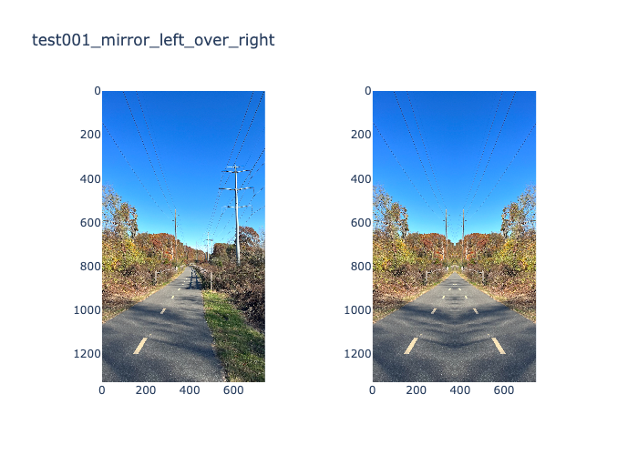

# Spirals 🌀

# Set Up

Not really sure what this project is going to be yet.

1. Use `asdf` or `pyenv` install python 3.12.3, set this as your python, ie. `asdf global python 3.12.3`
2. Clone this repo and `cd` into it
3. `python -m venv venv`
4. `source ./venv/bin/activate`
5. `pip install -e ."[dev]"`

# Functions

## Other transformations

### mirror_right_over_left

### mirror_left_over_right

### flip_horizontal

